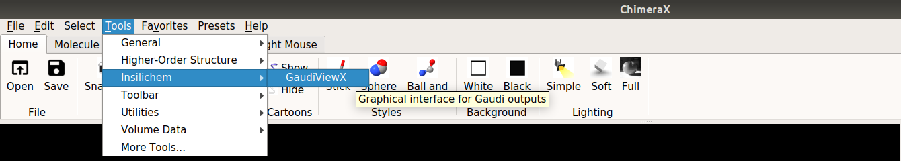
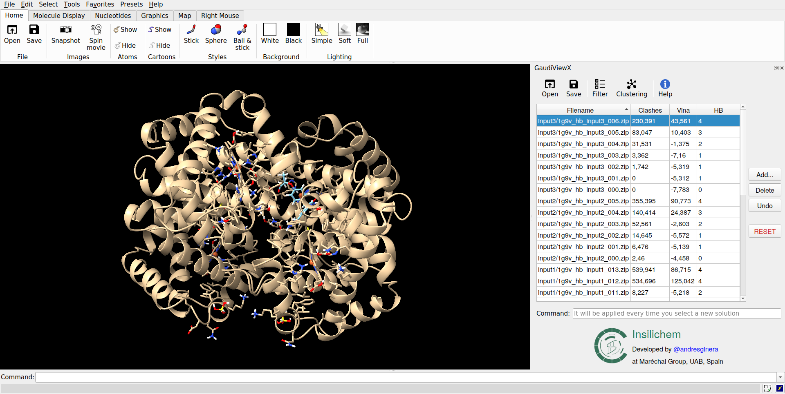
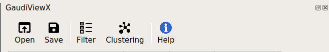
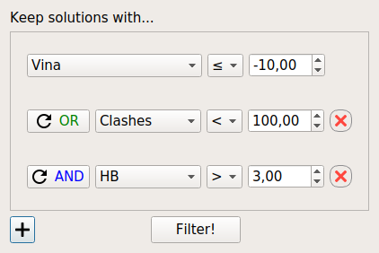
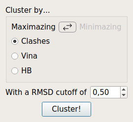

Manual
===========

Basic Use
---------

For open a new window of GaudiViewX, select the tool GaudiViewX inside Tools
-> Insilichem -> GaudiViewX:

And a new **window** will open for searching a Gaudi's output file. After the
selection of the file, a table with all the solutions will appear in your
ChimeraX. Selecting any of the solution will display the 3D drawing of the
molecules in your ChimeraX:

Toolbar
-------

In the toolbar there are 5 utilities:

|icon1| | Open
************

Open a new window to open a new output file closing all the models of a
previous output file loaded.

|icon2| | Save
**************

Open a new window to save the current data loaded in the table in the
same file or in a new one.

|icon3| | Filter
****************

.. |icon3| image:: ../src/checklist.png
    :width: 4%

This option let the user to select among all the solutions with ones of
interest. The user has to choose the objective for which he wants to filter
and select the logic behavior (>, <, =, ≥, ≤, ≠) and threshold of the filter:

|icon4| | Clustering
********************

.. |icon4| image:: ../src/cluster-icon.png
    :width: 4%

It allows you to do a clustering of the solutions loaded in the table. For
doing the clustering, you must specify:
   
- The **objective** for which you want to do the clustering.
- The behavior on **maximazing** or **minimazing** this objective.
- The **threshold of the RMSD** which which will determine if two solutions are considered equal or different.

With this way, all the cluster will have as a nucleus the best possible
solution for that cluster.

|icon5| | Help
**************

.. |icon5| image:: ../src/Info_Simple.svg.png
    :width: 4%

Displays the internal help window.

Table editing
-------------

You can also edit the different solutions loaded in the table:

* You can **add** new solutions from a different files as long as it has the same objectives.
* You can also **delete** the solutions selected.

And with the buttons of **Undo** and **Reset** you can returned to a previous state of
the table. You can undo until 5 actions and the button Reset will restore all
the table to the original ones from the first file loaded.

Command Line
------------

GaudiViewX has also incorporated a command line, that has the advantage with
respect the ChimeraX command line of being executed each time you select a new
solution. In this way you can watch, for example the residue 8 in all solution
writing ``show :8`` in the command line only once.

